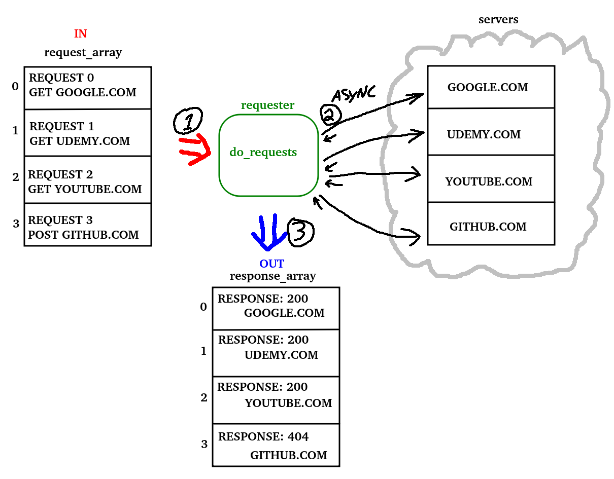

It allows multiple requests to be made asynchronously.

#### install

```bash
pip3 install  python-request-fanout requests
```


This can be done.


###Example:
 
```python
import requests
from python_request_fanout.requester import HTTPMethod, Requester

request_array = [
    requests.Request(
        HTTPMethod.GET.name,
        url="https://www.google.com"
    ),
    requests.Request(
        HTTPMethod.GET.name,
        url="https://www.udemy.com"
    ),
    requests.Request(
        HTTPMethod.GET.name,
        url="https://www.youtube.com"
    ),
    requests.Request(
        HTTPMethod.POST.name,
        url="https://www.github.com"
    ),
]
response_array = Requester.do_requests(request_array)
assert len(response_array) == 4
```

#### Sample diagram
[](doc/diagram.png)


